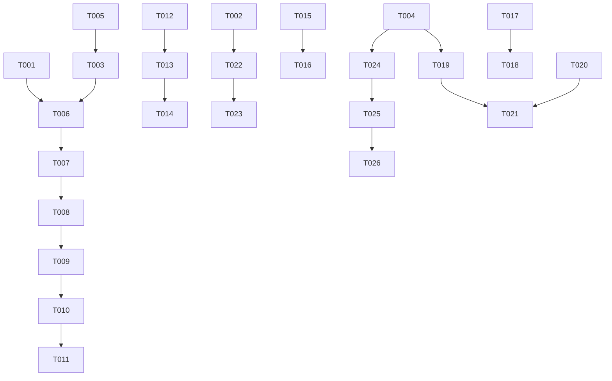

# Tasks: Bible Search & Verse Interaction

**Input**: Design documents from `/specs/001-verse-search/`
**Prerequisites**: plan.md, spec.md, research.md, data-model.md, contracts/

## Format: `[ID] [P?] [Story] Description`

- **[P]**: Can run in parallel (different files, no dependencies)
- **[Story]**: Which user story this task belongs to (e.g., US1, US2, US3)
- Include exact file paths in descriptions

## Phase 1: Setup (Shared Infrastructure)

**Purpose**: Project initialization and basic structure

- [x] T001 Create feature directory structure in `lib/features/search/` and `lib/features/verse_interaction/`
- [x] T002 Add `share_plus` dependency to `pubspec.yaml`

---

## Phase 2: Foundational (Blocking Prerequisites)

**Purpose**: Core infrastructure that MUST be complete before ANY user story can be implemented

- [x] T003 Optimize `SqlBibleSearchProvider.search` in `packages/bible_handler/lib/src/bible_search_provider.dart` to use SQL JOINs for book metadata
- [x] T004 Create `VerseInteractionProvider` interface and SQLite implementation in `packages/bible_handler/lib/src/verse_interaction_provider.dart`
- [x] T005 [P] Ensure `DatabaseHelper` in `lib/core/data/database_helper.dart` has all tables from `data-model.md`

**Checkpoint**: Foundation ready - user story implementation can now begin

---

## Phase 3: User Story 1 - Basic Keyword Search (Priority: P1) 🎯 MVP

**Goal**: Allow users to search for words/phrases across verses and navigate to them.

**Independent Test**: Enter "amor" in search bar, click a result, and see the reader scroll to that verse.

### Implementation for User Story 1

- [x] T006 Create `RepositorioBusca` in `lib/features/search/data/repositories/search_repository.dart`
- [x] T007 Implement `SearchBloc` with Portuguese events/states in `lib/features/search/presentation/bloc/search_bloc.dart`
- [x] T008 Create `TelaBusca` with search bar and results list in `lib/features/search/presentation/pages/search_screen.dart`
- [x] T009 [US1] Add "No results found" state to `TelaBusca` in `lib/features/search/presentation/pages/search_screen.dart`
- [x] T010 [US1] Update `BibliaBloc` to support `targetVerse` in `lib/features/biblia/bloc/biblia_bloc.dart`
- [x] T011 [US1] Implement scroll to verse in `TelaDeLeitura` in `lib/features/biblia/widgets/tela_de_leitura.dart`

**Checkpoint**: Basic search and navigation with scrolling is functional.

---

## Phase 4: User Story 7 - Book Name Matching (Priority: P2)

**Goal**: List books that match the search text (e.g., "exo" -> "Êxodo").

**Independent Test**: Type "joao" and see "João", "1 João", etc., in a separate section.

### Implementation for User Story 7

- [x] T012 [US7] Implement `matchBooks(String query)` in `packages/bible_handler/lib/src/bible_search_provider.dart`
- [x] T013 [US7] Update `RepositorioBusca` to include book matches in `lib/features/search/data/repositories/search_repository.dart`
- [x] T014 [US7] Update `TelaBusca` to display a "Books" section above verse results in `lib/features/search/presentation/pages/search_screen.dart`

---

## Phase 5: User Story 2 - Search Result Highlighting (Priority: P2)

**Goal**: Highlight the search term within the verse text in results.

**Independent Test**: Search for "fé" and see "fé" highlighted in the results.

### Implementation for User Story 2

- [x] T015 [P] [US2] Implement a `HighlightText` widget in `lib/features/search/presentation/widgets/highlight_text.dart`
- [x] T016 [US2] Apply highlighting to verse text in `lib/features/search/presentation/pages/search_screen.dart`

---

## Phase 6: User Story 3 - Version-Specific Search (Priority: P2)

**Goal**: Search within the currently selected Bible version.

**Independent Test**: Toggle "Search all versions" and verify results change.

### Implementation for User Story 3

- [x] T017 [US3] Add "Search all versions" checkbox to `TelaBusca` in `lib/features/search/presentation/pages/search_screen.dart`
- [x] T018 [US3] Update `SearchBloc` and `RepositorioBusca` to pass `versionId` to the provider in `lib/features/search/data/repositories/search_repository.dart`

---

## Phase 7: User Story 4 - Verse Marking & Highlighting (Priority: P2)

**Goal**: Allow users to highlight verses in the reader with background colors.

**Independent Test**: Long-press a verse, select a color from the modal, and see the verse background change.

### Implementation for User Story 4

- [x] T019 Create `HighlightRepository` in `lib/features/verse_interaction/data/repositories/highlight_repository.dart`
- [x] T020 [US4] Implement `HighlightBloc` to manage highlight states in `lib/features/verse_interaction/presentation/bloc/highlight_bloc.dart`
- [x] T021 [US4] Create `ColorPickerModal` for selecting background colors in `lib/features/verse_interaction/presentation/widgets/color_picker_modal.dart`
- [x] T022 [US4] Update `DisplaySingleVerse` to handle long press and show `ColorPickerModal` in `lib/features/biblia/widgets/display_single_verse.dart`
- [x] T023 [US4] Update `DisplaySingleVerse` to display background color based on highlight state in `lib/features/biblia/widgets/display_single_verse.dart`

---

## Phase 8: User Story 5 - Sharing & Multi-Verse Selection (Priority: P3)

**Goal**: Select multiple verses and share them with other apps.

**Independent Test**: Long-press a verse to enter selection mode, select another verse, tap "Share", and see the system share sheet with both verses.

### Implementation for User Story 5

- [ ] T031 [US5] Implement `VerseSelectionBloc` to manage multi-verse selection in `lib/features/verse_interaction/presentation/bloc/selection_bloc.dart`
- [ ] T032 [US5] Update `DisplaySingleVerse` to support selection state and tap-to-select in `lib/features/biblia/widgets/display_single_verse.dart`
- [ ] T033 [US5] Create `SelectionToolbar` to show actions (Highlight, Share) when verses are selected in `lib/features/verse_interaction/presentation/widgets/selection_toolbar.dart`
- [ ] T034 [US5] Implement `ShareService` to format and share single/multiple verses in `lib/core/services/share_service.dart`
- [ ] T035 [US5] Integrate `ShareService` into `SelectionToolbar` and `ColorPickerModal` in `lib/features/verse_interaction/presentation/widgets/selection_toolbar.dart`

---

## Phase 9: User Story 6 - Categorizing Verses (Priority: P3)

**Goal**: Group marked verses into categories.

**Independent Test**: Assign a verse to "Faith" category and see it in the "Faith" list.

### Implementation for User Story 6

- [ ] T024 Create `CategoryRepository` in `lib/features/verse_interaction/data/category_repository.dart`
- [ ] T025 Create `CategoryManagementScreen` in `lib/features/verse_interaction/presentation/pages/category_screen.dart`
- [ ] T026 [US6] Add "Add to Category" option to verse selection menu in `lib/features/verse_interaction/presentation/widgets/verse_options_sheet.dart`

---

## Phase 10: Polish & Cross-Cutting Concerns

- [x] T027 Add minimum character limit (3) to search input in `lib/features/search/presentation/pages/search_screen.dart`
- [x] T028 [P] Add loading indicators for search operations in `lib/features/search/presentation/pages/search_screen.dart`
- [x] T029 [P] Ensure all SQL operations are wrapped in try-catch with proper logging in `packages/bible_handler/lib/src/bible_search_provider.dart`
- [x] T030 [US1] Add total results count to `TelaBusca` header in `lib/features/search/presentation/pages/search_screen.dart`

---

## Dependency Graph

## Parallel Execution Examples

### Parallel Stream 1: Search UI & Logic
- T006, T007, T008 (Sequential)
- T015, T016 (Parallel to T008)

### Parallel Stream 2: Verse Interaction
- T019, T020, T021 (Sequential)
- T024, T025, T026 (Sequential, Parallel to Stream 1)

### Parallel Stream 3: Infrastructure
- T002, T022 (Sequential)
- T005 (Parallel to T001)
