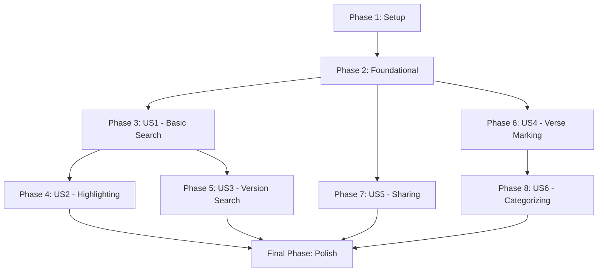

# Tasks: Bible Search & Verse Interaction

**Input**: Design documents from `/specs/001-verse-search/`
**Prerequisites**: plan.md (required), spec.md (required for user stories), research.md, data-model.md, contracts/

**Tests**: Unit and Widget tests are included as requested in the implementation plan.

**Organization**: Tasks are grouped by user story to enable independent implementation and testing of each story.

## Format: `[ID] [P?] [Story] Description`

- **[P]**: Can run in parallel (different files, no dependencies)
- **[Story]**: Which user story this task belongs to (e.g., US1, US2, US3)
- Include exact file paths in descriptions

## Phase 1: Setup (Shared Infrastructure)

**Purpose**: Project initialization and basic structure

- [X] T001 Add `sqflite`, `path`, and `share_plus` dependencies to `pubspec.yaml`
- [X] T002 [P] Create feature directory structure in `lib/features/search/` and `lib/features/verse_interaction/`
- [X] T003 [P] Define `BibleSearchProvider` and `VerseInteractionProvider` interfaces in `packages/bible_handler/lib/src/interfaces.dart`
- [X] T004 Initialize SQLite database helper in `lib/core/data/database_helper.dart`

## Phase 2: Foundational (Blocking Prerequisites)

**Purpose**: Core data persistence and caching logic

- [X] T005 Implement SQLite schema for `BibleVerse` with FTS5 support in `lib/core/data/database_helper.dart`
- [X] T006 Implement `cacheVersion` logic in `packages/bible_handler/lib/src/bible_cache_provider.dart`
- [X] T007 Implement in-memory loading of active Bible version in `packages/bible_handler/lib/src/bible_memory_loader.dart`
- [X] T008 Create unit tests for SQL caching and FTS5 search logic in `packages/bible_handler/test/cache_test.dart`

## Phase 3: User Story 1 - Basic Keyword Search (Priority: P1)

**Story Goal**: Search for words/phrases across verses and navigate to results.
**Independent Test**: Enter "Jesus" in search bar, see results, tap one, and verify reader opens at correct location.

- [X] T009 [US1] Implement `search` method using FTS5 in `packages/bible_handler/lib/src/bible_search_provider.dart`
- [X] T010 [US1] Create `SearchRepository` in `lib/features/search/data/search_repository.dart`
- [X] T011 [US1] Implement `SearchBloc` in `lib/features/search/presentation/bloc/search_bloc.dart`
- [X] T012 [US1] Create search screen UI with `ListView.builder` in `lib/features/search/presentation/search_screen.dart`
- [X] T013 [US1] Implement navigation from search result to Bible reader in `lib/features/search/presentation/search_screen.dart`
- [ ] T014 [US1] Create widget tests for search screen in `test/features/search/search_screen_test.dart`

## Phase 4: User Story 2 - Search Result Highlighting (Priority: P2)

**Story Goal**: Highlight search terms within results.
**Independent Test**: Search for "fé" and verify the word "fé" is bold/colored in the results list.

- [ ] T015 [P] [US2] Implement text highlighting utility in `lib/core/utils/text_highlighter.dart`
- [ ] T016 [US2] Update search result list item to use highlighting utility in `lib/features/search/presentation/widgets/search_result_tile.dart`

## Phase 5: User Story 3 - Version-Specific Search (Priority: P2)

**Story Goal**: Search within selected version or all versions.
**Independent Test**: Toggle "Search all versions" and verify results include multiple translations.

- [ ] T017 [US3] Update `search` method to support version filtering and multi-version search in `packages/bible_handler/lib/src/bible_search_provider.dart`
- [ ] T018 [US3] Add version toggle UI to search screen in `lib/features/search/presentation/search_screen.dart`
- [ ] T019 [US3] Update search result UI to display version labels in `lib/features/search/presentation/widgets/search_result_tile.dart`

## Phase 6: User Story 4 - Verse Marking & Highlighting (Priority: P2)

**Story Goal**: Highlight verses in the reader and persist them.
**Independent Test**: Highlight a verse, restart app, and verify highlight remains.

- [ ] T020 [US4] Implement `Highlight` SQL schema and repository in `lib/features/verse_interaction/data/highlight_repository.dart`
- [ ] T021 [US4] Implement `setHighlight` and `getHighlights` in `packages/bible_handler/lib/src/verse_interaction_provider.dart`
- [ ] T022 [US4] Add highlight color picker UI to Bible reader in `lib/features/reader/presentation/widgets/verse_action_menu.dart`
- [ ] T023 [US4] Update Bible reader to render highlights from SQL in `lib/features/reader/presentation/reader_screen.dart`

## Phase 7: User Story 5 - Sharing Verses (Priority: P3)

**Story Goal**: Share verses with formatted references.
**Independent Test**: Tap "Share" on a verse and verify share sheet contains text + reference.

- [ ] T024 [US5] Implement verse sharing service using `share_plus` in `lib/features/verse_interaction/domain/share_service.dart`
- [ ] T025 [US5] Add "Share" action to verse selection menu in `lib/features/reader/presentation/widgets/verse_action_menu.dart`

## Phase 8: User Story 6 - Categorizing Verses (Priority: P3)

**Story Goal**: Group marked verses into custom categories.
**Independent Test**: Create "Hope" category, add verse, and verify it appears in "Hope" list.

- [ ] T026 [US6] Implement `Category` and `VerseCategory` SQL schemas in `lib/core/data/database_helper.dart`
- [ ] T027 [US6] Create `CategoryRepository` in `lib/features/verse_interaction/data/category_repository.dart`
- [ ] T028 [US6] Implement category management UI (create/delete) in `lib/features/verse_interaction/presentation/category_management_screen.dart`
- [ ] T029 [US6] Add "Add to Category" action to verse menu in `lib/features/reader/presentation/widgets/verse_action_menu.dart`
- [ ] T030 [US6] Create "Categorized Verses" view in `lib/features/verse_interaction/presentation/categorized_verses_screen.dart`

## Final Phase: Polish & Cross-Cutting Concerns

- [ ] T031 Implement accent-insensitive search logic in SQL/Dart
- [ ] T032 Optimize SQL bulk inserts for caching with transactions
- [ ] T033 Final integration testing of all user stories
- [ ] T034 Documentation update in `README.md` for new features

## Dependency Graph

## Parallel Execution Examples

### Per User Story
- **US1**: T010 (Repository) and T012 (UI) can be developed in parallel once T011 (Bloc) interface is defined.
- **US4**: T020 (Data) and T022 (UI) can be developed in parallel.

## Implementation Strategy

1. **MVP First**: Complete Phase 1, 2, and 3 to deliver the core search functionality.
2. **Incremental Delivery**: Deliver US4 (Marking) next as it's a high-value feature.
3. **Polish**: Finalize with sharing and categorization.
