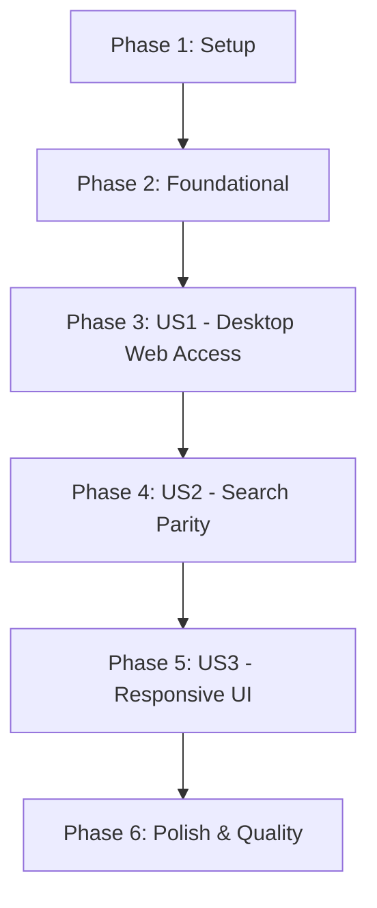

# Tasks: Web Support for Holy App

**Input**: Design documents from `specs/001-web-support/`
**Prerequisites**: [plan.md](plan.md), [spec.md](spec.md), [research.md](research.md), [data-model.md](data-model.md), [contracts/database_loader.md](contracts/database_loader.md)

## Implementation Strategy

We will follow an incremental approach:
1.  **Setup**: Configure dependencies and Firebase for the Web platform.
2.  **Foundational**: Implement the core logic for downloading and persisting the SQLite database in the browser (IndexedDB).
3.  **Phase 3 (P1)**: Ensure basic reading and navigation works on desktop/mobile web.
4.  **Phase 4 (P1)**: Implement search parity (multi-search and reordering).
5.  **Phase 5 (P2)**: Refine responsive UI and implement platform fallbacks.

## Dependency Graph

## Phase 1: Setup (Shared Infrastructure)

- [x] T001 Add `sqflite_common_ffi_web`, `sqlite3`, and `firebase_core_web` to `pubspec.yaml`
- [x] T002 [P] Configure Firebase Hosting and obtain Web API keys in `firebase.json` and `lib/firebase_options.dart`
- [x] T003 Initialize Wasm support by downloading `sqlite3.wasm` to the `web/` directory

---

## Phase 2: Foundational (Blocking Prerequisites)

**Purpose**: Database persistence and platform-aware service initialization

- [x] T004 Implement `WebDatabaseLoader` in `packages/bible_handler/lib/src/services/web_database_loader.dart` per `contracts/database_loader.md`
- [x] T005 [P] Implement `WebSqliteProvider` in `packages/bible_handler/lib/src/bible_search_provider.dart` using `databaseFactoryFfiWeb`
- [x] T006 Update `bible_handler` main entry point to switch providers based on `kIsWeb`
- [x] T007 Create `SplashLoader` widget in `lib/features/initialization/presentation/pages/splash_loader.dart` to handle asset download to IndexedDB

---

## Phase 3: User Story 1 - Desktop Web Access (Priority: P1) 🎯 MVP

**Goal**: Users can read the Bible on a desktop browser.
**Independent Test**: Run `flutter run -d chrome`, verify the splash screen downloads the DB and shows the main reader.

### Tests for User Story 1

- [x] T008 [P] [US1] Unit test for `WebDatabaseLoader` downloads successfully in `packages/bible_handler/test/web_database_loader_test.dart`
- [x] T009 [US1] Integration test for web boot sequence using `flutter_test` (Chrome)

### Implementation for User Story 1

- [x] T010 [US1] Update `main.dart` to initialize `WebDatabaseLoader` before app startup
- [x] T011 [P] [US1] Ensure `ScreenReaderPage` in `lib/features/biblia/widgets/screen_reader_page.dart` renders correctly on web
- [x] T012 [US1] Fix any scroll-to-index issues in `ListView` on web platform

---

## Phase 4: User Story 2 - Search Parity (Priority: P1)

**Goal**: Full functional parity for multi-box search and reordering on web.
**Independent Test**: Use the search feature on web; verify drag-and-drop works with a mouse.

### Tests for User Story 2

- [x] T013 [P] [US2] Widget test for `MultipleSearchHeader` interaction on web in `test/features/search/widgets/multiple_search_header_web_test.dart`

### Implementation for User Story 2

- [x] T014 [US2] Verify `ReorderableListView` in `lib/features/search/presentation/widgets/multiple_search_header.dart` handles mouse input correctly
- [x] T015 [US2] Ensure `SqlBibleSearchProvider` FTS5 queries work via Wasm in `packages/bible_handler/lib/src/bible_search_provider.dart`
- [x] T016 [US2] Implement platform-specific `SearchBloc` debounce (500ms) logic for web

---

## Phase 5: User Story 3 - Responsive UI (Priority: P2)

**Goal**: UI adapts to desktop vs mobile browser sizes.
**Independent Test**: Resize browser window; verify `NavigationRail` appears on wide screens.

### Implementation for User Story 3

- [x] T017 [US3] Refactor `MainScreen` in `lib/app/presentation/pages/main_screen.dart` to use `AdaptiveScaffold` or `LayoutBuilder`
- [x] T018 [US3] Implement `NavigationRail` for wide screens in `lib/app/presentation/widgets/desktop_nav_rail.dart`
- [x] T019 [P] [US3] Add max-width container (e.g., 900px) to Bible reader views to prevent text stretching
- [x] T020 [US3] Implement web versions of shared services (gal, share_plus) in `lib/core/services/platform_service_web.dart`

---

## Phase 6: Polish & Quality

- [x] T021 Run `flutter analyze` and fix all web-related warnings/lints
- [x] T022 Optimize `index.html` loading states and PWA manifest
- [x] T023 Final E2E test on Chrome, Firefox, and Safari (Mobile)
- [x] T024 Perform `flutter build web --release` and verify bundle size
