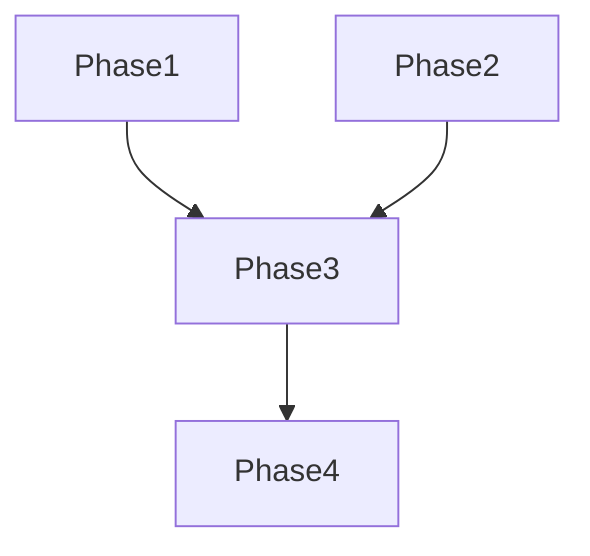

# Tasks: Download Loader

**Input**: Design documents from `specs/003-download-loader/`
**Prerequisites**: plan.md, spec.md

**Organization**: Tasks are grouped by user story to enable independent implementation and testing of each story.

## Format: `[ID] [P?] [Story] Description`

- **[P]**: Can run in parallel (different files, no dependencies)
- **[Story]**: Which user story this task belongs to (e.g., US1, US2, US3)
- Include exact file paths in descriptions

## Phase 1: Setup

- [x] T001 [P] Verify `BibliaLoading` state is correctly emitted in `lib/features/biblia/bloc/biblia_bloc.dart`

## Phase 2: Foundational

- [x] T002 [P] Create a reusable `LoadingWidget` in `lib/shared/widgets/loading_widget.dart` (optional but good practice)

## Phase 3: User Story 1 - Show Loader during Download (Priority: P1)

**Goal**: Show a loader when the Bible is being loaded/downloaded.

**Independent Test**: Clear cache or select a new version and verify the loader appears.

- [x] T003 [US1] Update `TelaDeLeitura` to show a `CircularProgressIndicator` during `BibliaLoading` state in `lib/features/biblia/widgets/tela_de_leitura.dart`
- [x] T004 [US1] Add a descriptive text "Baixando Bíblia..." to the loader in `lib/features/biblia/widgets/tela_de_leitura.dart`

## Phase 4: Polish & Refinement

- [x] T005 [P] Ensure the loader is centered and follows the app's theme in `lib/features/biblia/widgets/tela_de_leitura.dart`

## Dependency Graph

## Implementation Strategy

1. **Basic Loader**: First, replace the empty `Container` with a `CircularProgressIndicator`.
2. **Refinement**: Add text and styling to make it clear that a download is happening.
