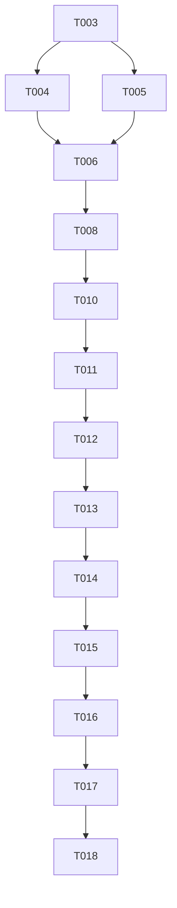

# Tasks: Advanced Multiple Search Joins

**Input**: specs/003-multiple-search-joins/

## Phase 1: Setup
- [ ] T001 [P] Confirm feature docs aligned (spec/plan/research) in specs/003-multiple-search-joins/plan.md

---

## Phase 2: Foundational (Blocking Prerequisites)
- [ ] T002 Implement per-term FTS query helper in packages/bible_handler/lib/src/bible_search_provider.dart
- [ ] T003 Build sequential AND/OR join reducer over subquery results in packages/bible_handler/lib/src/bible_search_provider.dart
- [ ] T004 Ensure repository forwards query parts and preserves highlights in lib/features/search/data/repositories/search_repository.dart
- [ ] T005 Ensure BLoC carries full query list and highlight terms to UI in lib/features/search/presentation/bloc/search_bloc.dart

---

## Phase 3: User Story 1 - Multiple Keywords with AND (Priority: P1) 🎯 MVP
**Goal**: Intersect results for all >=3-char terms.
**Independent Test**: Two-term AND search returns only verses containing both terms; highlights show both terms.

- [ ] T006 [P] [US1] Add intersection-focused unit tests for sequential join in packages/bible_handler/test/search_joins_test.dart
- [ ] T007 [US1] Wire repository + BLoC to new sequential AND pipeline in lib/features/search/data/repositories/search_repository.dart and lib/features/search/presentation/bloc/search_bloc.dart
- [ ] T008 [US1] Pass matched term list to highlighting widget in lib/features/search/presentation/widgets/highlighted_text.dart

---

## Phase 4: User Story 2 - Dynamic Query Management (Priority: P2)
**Goal**: Add/remove up to 5 terms, ignore <3-char terms, keep global operator toggle.
**Independent Test**: Add/remove bars updates state and results; empty/short terms are ignored without breaking joins.

- [ ] T009 [P] [US2] Enforce max 5 query parts and ignore terms <3 chars in lib/features/search/presentation/bloc/search_bloc.dart
- [ ] T010 [P] [US2] Keep global operator toggle applied to indices 1..N in lib/features/search/presentation/widgets/multiple_search_header.dart
- [ ] T011 [US2] Ensure UI refreshes when query list shrinks/expands in lib/features/search/presentation/widgets/multiple_search_header.dart and lib/features/search/presentation/pages/search_screen.dart

---

## Phase 5: User Story 3 - OR Logic (Priority: P2)
**Goal**: Union results across terms when toggle is OR.
**Independent Test**: OR returns union; switching AND↔OR changes counts accordingly.

- [ ] T012 [P] [US3] Add OR-focused unit tests for sequential join in packages/bible_handler/test/search_joins_test.dart
- [ ] T013 [US3] Ensure reducer handles OR branches identically to UI toggle in packages/bible_handler/lib/src/bible_search_provider.dart
- [ ] T014 [US3] Ensure BLoC/operator toggle updates queries before dispatching search in lib/features/search/presentation/bloc/search_bloc.dart

---

## Final Phase: Polish & Cross-Cutting
- [ ] T015 [P] Refresh quickstart with validation steps for AND/OR joins in specs/003-multiple-search-joins/quickstart.md
- [ ] T016 [P] Remove temporary debug logs and confirm performance <500ms in packages/bible_handler/lib/src/bible_search_provider.dart

---

## Dependencies & Execution Order
- Phase 1 → Phase 2 → User Stories (Phase 3 P1 first, then Phase 4/5 P2) → Polish.
- Story priority order: US1 (P1) before US2/US3 (P2). User stories independent once foundational is done.

## Parallel Execution Examples
- Foundational: T002, T003 can proceed in parallel with clear interfaces; T004/T005 after reducer is ready.
- US1: T006 can run in parallel with T007/T008 once reducer stub exists.
- US2: T009 and T010 can run in parallel; T011 after bloc updates.
- US3: T012 in parallel with T013/T014 once reducer supports OR path.

- [X] T014 [US3] Implement FTS5 "OR" logic in `SqlBibleSearchProvider.advancedSearch` within `packages/bible_handler/lib/src/bible_search_provider.dart`
- [X] T015 [US3] Add `JoinToggle` widget to switch between AND/OR in `lib/features/search/presentation/widgets/join_toggle.dart`
- [X] T016 [US3] Update `MultipleSearchHeader` to include `JoinToggle` between search bars in `lib/features/search/presentation/widgets/multiple_search_header.dart`
- [X] T017 [US3] Add unit tests for "OR" join logic in `packages/bible_handler/test/search_joins_test.dart`

## Phase 6: Polish & Cross-cutting
**Goal**: Final performance tuning and UX refinements.

- [ ] T018 Optimize SQLite multi-term result highlighting
- [ ] T019 Ensure search state persistence (if any) handles multiple terms
- [ ] T020 Run full integration test suite for multi-search

---

## Dependency Graph

## Parallel Execution Examples

### User Story 1 (Logic + Model)
- **Developer A**: T003 (Models), T004 (Interface)
- **Developer B**: T005 (HighlightedText UI)

### User Story 2 (UI Components)
- **Developer A**: T010 (Single Bar)
- **Developer B**: T011 (Header Container)

## Implementation Notes
- **FTS5 MATCH**: For AND logic, use `MATCH 'term1 term2'`. For OR logic, use `MATCH 'term1 OR term2'`.
- **Performance**: Ensure each term is validated for 3+ characters before adding to the FTS query string.
- **UI Layout**: The `MultipleSearchHeader` should use `AnimateList` or similar for smooth bar addition/removal.
