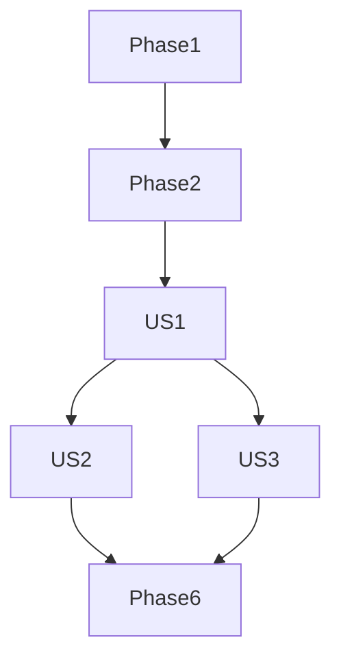

# Tasks: Search State Persistence

**Input**: Design documents from `specs/006-search-state-persistence/`
**Prerequisites**: plan.md, spec.md, research.md, data-model.md

**Organization**: Tasks are grouped by user story to enable independent implementation and testing of each story.

## Format: `[ID] [P?] [Story] Description`

- **[P]**: Can run in parallel (different files, no dependencies)
- **[Story]**: Which user story this task belongs to (e.g., US1, US2, US3)
- Include exact file paths in descriptions

## Phase 1: Setup (Shared Infrastructure)

**Purpose**: Project initialization and basic structure

- [x] T001 [P] Verify `flutter_bloc` and `RepositorioBusca` are correctly configured in `lib/main.dart`

---

## Phase 2: Foundational (Blocking Prerequisites)

**Purpose**: Core infrastructure that MUST be complete before ANY user story can be implemented

- [x] T002 Lift `SearchBloc` instantiation to `BibliaPage` in `lib/features/biblia/views/biblia_view.dart`
- [x] T003 Provide `SearchBloc` to `BibliaView` using `BlocProvider` in `lib/features/biblia/views/biblia_view.dart`
- [x] T004 Update `BibliaAppBar` to use `BlocProvider.value` when pushing `TelaBusca` in `lib/features/biblia/widgets/biblia_app_bar.dart`

---

## Phase 3: User Story 1 - Persistent Search Results (Priority: P1) 🎯 MVP

**Goal**: Search results remain available after navigating to a verse and back.

**Independent Test**: Search for "fé", click a result, go back to search, and verify results are still there.

- [x] T005 [P] [US1] Ensure `SearchBloc` does not reset state on initialization if it already has results in `lib/features/search/presentation/bloc/search_bloc.dart`
- [x] T006 [US1] Update `TelaBusca` to display the current state of `SearchBloc` immediately upon opening in `lib/features/search/presentation/pages/search_screen.dart`
- [x] T007 [US1] Verify that navigating back from the reader to `TelaBusca` preserves the scroll position and results

---

## Phase 4: User Story 2 - Explicit Search Closure (Priority: P2)

**Goal**: Clear search state only when explicitly closed.

**Independent Test**: Click "Close" in search, reopen, and verify it's empty.

- [x] T008 [P] [US2] Add a "Close" or "Clear" button to the search bar in `lib/features/search/presentation/pages/search_screen.dart`
- [x] T009 [US2] Dispatch `LimparBusca` event when the explicit close action is triggered in `lib/features/search/presentation/pages/search_screen.dart`
- [x] T010 [US2] Ensure `SearchBloc` correctly handles `LimparBusca` by emitting `BuscaInicial` in `lib/features/search/presentation/bloc/search_bloc.dart`

---

## Phase 5: User Story 3 - Navigation Between Reader and Search (Priority: P2)

**Goal**: Clear way to toggle between reader and active search.

**Independent Test**: Verify the search icon in the reader takes the user back to their active search session.

- [x] T011 [US3] Update `BibliaAppBar` search icon behavior to indicate an active search session (e.g., different icon or badge) in `lib/features/biblia/widgets/biblia_app_bar.dart`
- [x] T012 [US3] Ensure the search icon always opens the existing `SearchBloc` session in `lib/features/biblia/widgets/biblia_app_bar.dart`

---

## Phase 6: Polish & Refinement

**Purpose**: UX improvements and edge case handling.

- [x] T013 [P] Handle Bible version changes: Clear or update search results when the active version changes in `lib/features/search/presentation/bloc/search_bloc.dart`
- [ ] T014 [P] Add unit tests for `SearchBloc` to verify state persistence and reset logic in `test/features/search/search_bloc_test.dart`
- [ ] T015 [P] Add widget test to verify `TelaBusca` preserves state after navigation in `test/features/search/search_screen_test.dart`

## Dependency Graph

## Implementation Strategy

1. **Foundation First**: Lifting the `SearchBloc` is the most critical step. Without this, persistence is impossible.
2. **MVP (US1)**: Focus on ensuring the results stay visible when navigating back.
3. **Control (US2)**: Add the ability to clear the search so the user isn't "stuck" with old results.
4. **UX (US3)**: Refine the navigation to make the feature feel integrated.
