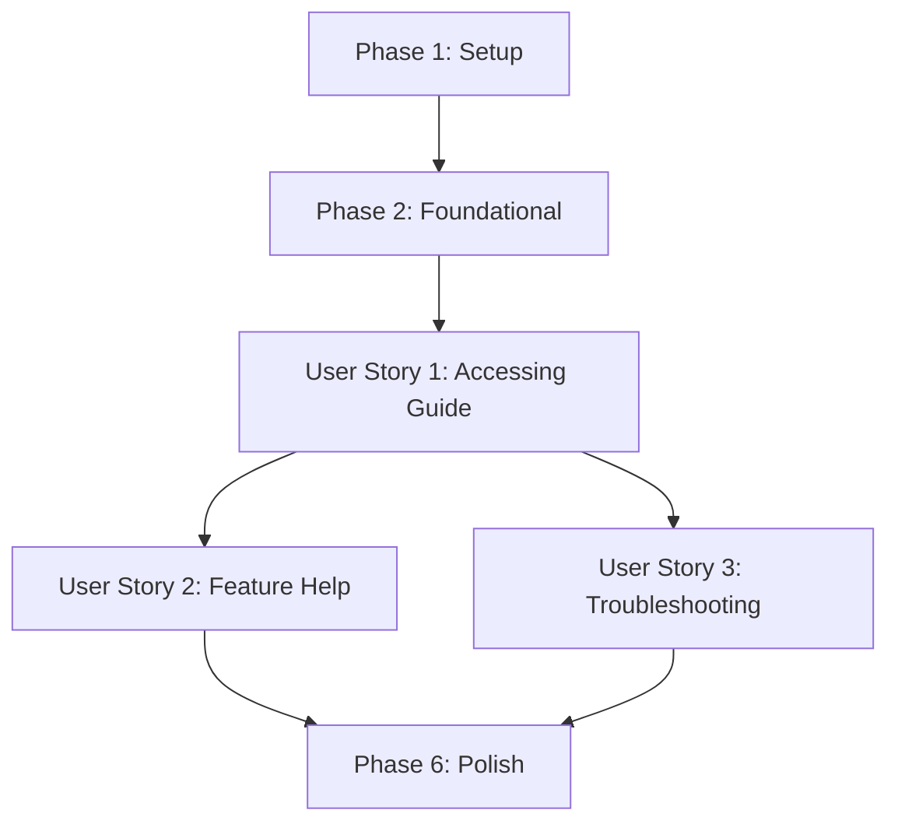

# Tasks: User Documentation

**Input**: Design documents from `/specs/006-user-documentation/`
**Prerequisites**: plan.md (required), spec.md (required for user stories)

## Format: `[ID] [P?] [Story] Description`

- **[P]**: Can run in parallel (different files, no dependencies)
- **[Story]**: Which user story this task belongs to (e.g., US1, US2, US3)
- Include exact file paths in descriptions

## Phase 1: Setup

**Purpose**: Project initialization and basic structure

- [X] T001 Create `doc/USER_GUIDE.md` skeleton with basic header
- [X] T002 [P] Define the structure and table of contents in `doc/USER_GUIDE.md`

## Phase 3: User Story 1 - Accessing the User Guide (Priority: P1) 🎯 MVP

**Goal**: Establish the primary entry point for user help.

**Independent Test**: Verify that `doc/USER_GUIDE.md` exists and is linked from the root `README.md`.

- [X] T003 [US1] Implement "Getting Started" section in `doc/USER_GUIDE.md`
- [X] T004 [US1] Implement "Reading the Bible" section in `doc/USER_GUIDE.md`
- [X] T005 [US1] Update root `README.md` to link to `doc/USER_GUIDE.md`

## Phase 4: User Story 2 - Feature-Specific Help (Priority: P2)

**Goal**: Provide detailed instructions for specific features.

**Independent Test**: Verify that the User Guide contains sections for Search, Downloads, and Profile.

- [X] T006 [US2] Implement "Searching Verses" section in `doc/USER_GUIDE.md`
- [X] T007 [US2] Implement "Managing Downloads" section in `doc/USER_GUIDE.md`
- [X] T008 [US2] Implement "User Profile & Settings" section in `doc/USER_GUIDE.md`

## Phase 5: User Story 3 - Troubleshooting & FAQ (Priority: P3)

**Goal**: Help users resolve common issues independently.

**Independent Test**: Verify the existence of Troubleshooting and FAQ sections in `doc/USER_GUIDE.md`.

- [X] T009 [US3] Implement "Troubleshooting" section in `doc/USER_GUIDE.md`
- [X] T010 [US3] Implement "FAQ" section in `doc/USER_GUIDE.md`

## Phase 6: Polish & Cross-Cutting Concerns

- [X] T011 Verify all links and formatting in `doc/USER_GUIDE.md`
- [X] T012 Final review of the User Guide content with stakeholders

## Phase 7: Improvements (Current)

**Purpose**: Refine documentation to reflect actual implementation status and add missing details.

- [X] T013 [US2] Add "Versículos Marcados" section to `doc/USER_GUIDE.md`
- [X] T014 [US2] Add "Personalização de Cores" section to `doc/USER_GUIDE.md`
- [X] T015 [US2] Add "Em Breve" tags to planned features (e.g., Cloud Sync) in `doc/USER_GUIDE.md`
- [X] T016 [US2] Refine "Histórico de Pesquisas" details in `doc/USER_GUIDE.md`

## Dependency Graph

## Parallel Execution Examples

- **Parallel Set 1**: T006, T007, T008 (US2)
- **Parallel Set 2**: T009, T010 (US3)

## Implementation Strategy

- **MVP**: Complete Phase 1, 2, and 3 to provide the basic guide and link it from the README.
- **Incremental**: Add detailed feature help (Phase 4) and troubleshooting (Phase 5) as separate increments.
