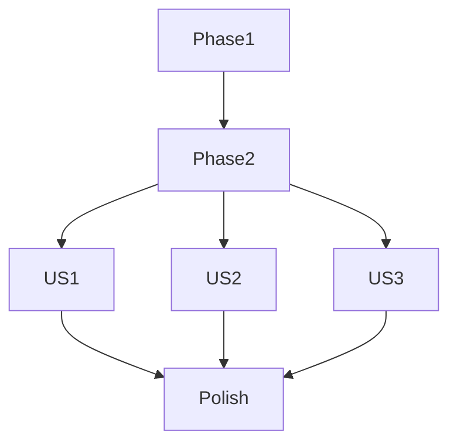

# Tasks: User Profile Screen ("EU")

**Input**: Design documents from `/specs/008-user-profile/`
**Prerequisites**: plan.md (required), spec.md (required for user stories), research.md, data-model.md, contracts/

## Format: `[ID] [P?] [Story] Description`

- **[P]**: Can run in parallel (different files, no dependencies)
- **[Story]**: Which user story this task belongs to (e.g., US1, US2, US3)
- Include exact file paths in descriptions

## Phase 1: Setup (Shared Infrastructure)

**Purpose**: Project initialization and basic structure

- [X] T001 [P] Create feature directory structure in lib/features/profile/
- [X] T002 [P] Add profile-related localization strings in lib/core/localization/l10n/app_pt.arb, app_en.arb, and app_es.arb

## Phase 2: Foundational (Blocking Prerequisites)

**Purpose**: Core infrastructure that MUST be complete before ANY user story can be implemented

- [X] T003 Update DatabaseHelper to include search_history table in lib/core/data/database_helper.dart
- [X] T004 [P] Implement SearchHistory model in lib/features/profile/data/models/search_history_model.dart
- [X] T005 [P] Define ISearchHistoryRepository interface in lib/features/profile/domain/repositories/i_search_history_repository.dart
- [X] T006 Implement SearchHistoryRepository in lib/features/profile/data/repositories/search_history_repository.dart
- [X] T007 [P] Define IProfileRepository interface in lib/features/profile/domain/repositories/i_profile_repository.dart
- [X] T008 Implement ProfileRepository (SharedPreferences) in lib/features/profile/data/repositories/profile_repository.dart
- [X] T009 Register new repositories in lib/main.dart MultiRepositoryProvider

## Phase 3: User Story 1 - Access and View Marked Verses (Priority: P1) 🎯 MVP

**Goal**: Display a list of verses marked by the user in the profile screen.

**Independent Test**: Mark a verse in the reader, go to the profile screen, and see it listed.

### Implementation for User Story 1

- [X] T010 [P] [US1] Create MarkedVersesBloc to handle loading marked verses in lib/features/profile/presentation/bloc/marked_verses_bloc.dart
- [ ] T011 [P] [US1] Create MarkedVerseItem widget in lib/features/profile/presentation/widgets/marked_verse_item.dart
- [ ] T012 [US1] Implement ProfileView with "Marked Verses" section in lib/features/profile/presentation/views/profile_view.dart
- [ ] T013 [US1] Implement navigation from MarkedVerseItem to BibliaPage in lib/features/profile/presentation/widgets/marked_verse_item.dart

## Phase 4: User Story 2 - Manage Search History (Priority: P2)

**Goal**: Display and manage recent search queries.

**Independent Test**: Perform a search, see it in the profile history, tap to repeat, or clear history.

### Implementation for User Story 2

- [ ] T014 [P] [US2] Create SearchHistoryBloc in lib/features/profile/presentation/bloc/search_history_bloc.dart
- [ ] T015 [P] [US2] Create SearchHistoryItem widget in lib/features/profile/presentation/widgets/search_history_item.dart
- [ ] T016 [US2] Add "Search History" section to ProfileView in lib/features/profile/presentation/views/profile_view.dart
- [ ] T017 [US2] Integrate SearchHistoryRepository.addSearchEntry into existing search logic in lib/features/search/presentation/bloc/search_bloc.dart

## Phase 5: User Story 3 - Customize App Theme Color (Priority: P3)

**Goal**: Allow users to change the app's primary accent color.

**Independent Test**: Select a color in profile, see UI update immediately, and persist after restart.

### Implementation for User Story 3

- [ ] T018 [P] [US3] Update ThemeState and ThemeCubit to include seedColor in lib/core/design_system/theme_extension/theme_manager.dart
- [ ] T019 [US3] Update AppTheme.light and AppTheme.dark to use dynamic seedColor in lib/core/design_system/theme_extension/app_theme_extension.dart
- [ ] T020 [P] [US3] Create ColorPalette widget for color selection in lib/features/profile/presentation/widgets/color_palette.dart
- [ ] T021 [US3] Add "Theme Customization" section to ProfileView in lib/features/profile/presentation/views/profile_view.dart

## Phase 6: Polish & Cross-Cutting Concerns

- [ ] T022 Implement MainPage with BottomNavigationBar to switch between BibliaPage and ProfilePage in lib/app/main_page.dart
- [ ] T023 Update App widget to use MainPage as home in lib/app/app.dart
- [ ] T024 [P] Add empty state illustrations/messages for marked verses and search history
- [ ] T025 [P] Ensure accessibility (contrast) for dynamic theme colors

## Dependency Graph

## Parallel Execution Examples

- **Setup**: T001, T002
- **Foundational**: T004, T005, T007
- **US1**: T010, T011
- **US2**: T014, T015
- **US3**: T018, T020
