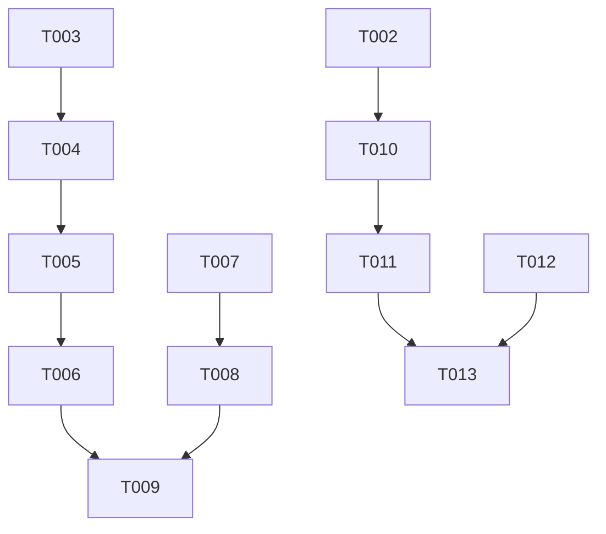

# Tasks: Premium Search Filters & History

**Input**: Design documents from `specs/009-premium-search-filters/`
**Prerequisites**: [plan.md](specs/009-premium-search-filters/plan.md), [spec.md](specs/009-premium-search-filters/spec.md), [research.md](specs/009-premium-search-filters/research.md), [data-model.md](specs/009-premium-search-filters/data-model.md), [search_contract.md](specs/009-premium-search-filters/contracts/search_contract.md)

**Organization**: Tasks are grouped by user story to enable independent implementation and testing of each story.

## Format: `[ID] [P?] [Story] Description`

- **[P]**: Can run in parallel (different files, no dependencies)
- **[Story]**: Which user story this task belongs to (e.g., US1, US2, US3)
- Include exact file paths in descriptions

---

## Phase 1: Setup (Shared Infrastructure)

**Purpose**: Project initialization and basic structure

- [x] T001 Verify feature branch `009-premium-search-filters` and environment configuration

---

## Phase 2: Foundational (Blocking Prerequisites)

**Purpose**: Core infrastructure that MUST be complete before ANY user story can be implemented

**⚠️ CRITICAL**: No user story work can begin until this phase is complete

- [x] T002 Update `DatabaseService` to include `verse_history` table in [lib/core/services/database_service.dart](lib/core/services/database_service.dart)
- [x] T003 [P] Update `SearchResult` model to include `versionId` and `versionAbbreviation` in [packages/bible_handler/lib/src/models/search_result.dart](packages/bible_handler/lib/src/models/search_result.dart)
- [x] T004 Update `SqlBibleSearchProvider` to return version metadata in [packages/bible_handler/lib/src/bible_search_provider.dart](packages/bible_handler/lib/src/bible_search_provider.dart)

**Checkpoint**: Foundation ready - user story implementation can now begin

---

## Phase 3: User Story 1 - Version in Results (Priority: P1) 🎯 MVP

**Goal**: Display the Bible version (e.g., "NVI", "ACF") next to each search result to provide context.

**Independent Test**: Perform a search and verify that each result tile shows the version abbreviation.

### Implementation for User Story 1

- [x] T005 [P] [US1] Update `SearchResult` to include version abbreviation in [packages/bible_handler/lib/src/models/search_result.dart](packages/bible_handler/lib/src/models/search_result.dart)
- [x] T006 [US1] Update `SearchScreen` result list to display version label in [lib/features/search/presentation/pages/search_screen.dart](lib/features/search/presentation/pages/search_screen.dart)

**Checkpoint**: User Story 1 functional - version context visible in search results.

---

## Phase 4: User Story 2 - Bible Version Filter (Priority: P1)

**Goal**: Allow users to filter search results by a specific Bible version using a simple single-selection UI.

**Independent Test**: Select a version from the filter and verify that only results from that version are shown.

### Implementation for User Story 2

- [x] T007 [P] [US2] Add `selectedVersionId` to `SearchState` in [lib/features/search/presentation/bloc/search_state.dart](lib/features/search/presentation/bloc/search_state.dart)
- [x] T008 [US2] Add `FilterByVersion` event and update `SearchBloc` logic in [lib/features/search/presentation/bloc/search_bloc.dart](lib/features/search/presentation/bloc/search_bloc.dart)
- [x] T009 [US2] Implement version selection UI (Dropdown or Chips) in [lib/features/search/presentation/pages/search_screen.dart](lib/features/search/presentation/pages/search_screen.dart)

**Checkpoint**: User Story 2 functional - users can filter results by version.

---

## Phase 5: User Story 3 - Verse History Tracking (Priority: P2)

**Goal**: Automatically track which verses the user taps on in search results to improve engagement.

**Independent Test**: Tap a search result, then navigate to the history page and verify the verse reference is listed.

### Implementation for User Story 3

- [x] T010 [P] [US3] Create `VerseHistoryRepository` for SQLite operations in [lib/features/profile/data/repositories/verse_history_repository.dart](lib/features/profile/data/repositories/verse_history_repository.dart)
- [x] T011 [US3] Create `VerseHistoryBloc` to manage history state in [lib/features/profile/presentation/bloc/verse_history_bloc.dart](lib/features/profile/presentation/bloc/verse_history_bloc.dart)
- [x] T012 [US3] Update `SearchScreen` to trigger history save on result tap in [lib/features/search/presentation/pages/search_screen.dart](lib/features/search/presentation/pages/search_screen.dart)
- [x] T013 [US3] Implement `VerseHistoryPage` to display the list of recently viewed verses in [lib/features/profile/presentation/pages/verse_history_page.dart](lib/features/profile/presentation/pages/verse_history_page.dart)

**Checkpoint**: User Story 3 functional - verse history is tracked and viewable.

---

## Phase 6: Polish & Cross-Cutting Concerns

**Purpose**: Final refinements and verification

- [x] T014 Ensure consistent styling for version labels and filters across themes
- [x] T015 Verify performance of history tracking and filtered searches with large datasets
- [x] T016 Update documentation in [doc/ARCHITECTURE.md](doc/ARCHITECTURE.md) regarding the new history tracking

## Dependency Graph

## Parallel Execution Opportunities

- **Story 1 & 2**: Can be worked on simultaneously once Phase 2 is complete.
- **Story 3**: Repository and BLoC (T010, T011) can be developed in parallel with Story 1/2 UI work.
- **Models**: `SearchResult` updates (T003) can be done immediately.

## Implementation Strategy

1. **MVP First**: Complete Story 1 (Version in Results) as it provides immediate value with minimal complexity.
2. **Incremental Delivery**: Story 2 (Filter) follows to complete the "Premium Search" experience.
3. **Engagement**: Story 3 (History) is implemented last as it adds a new persistent feature.
