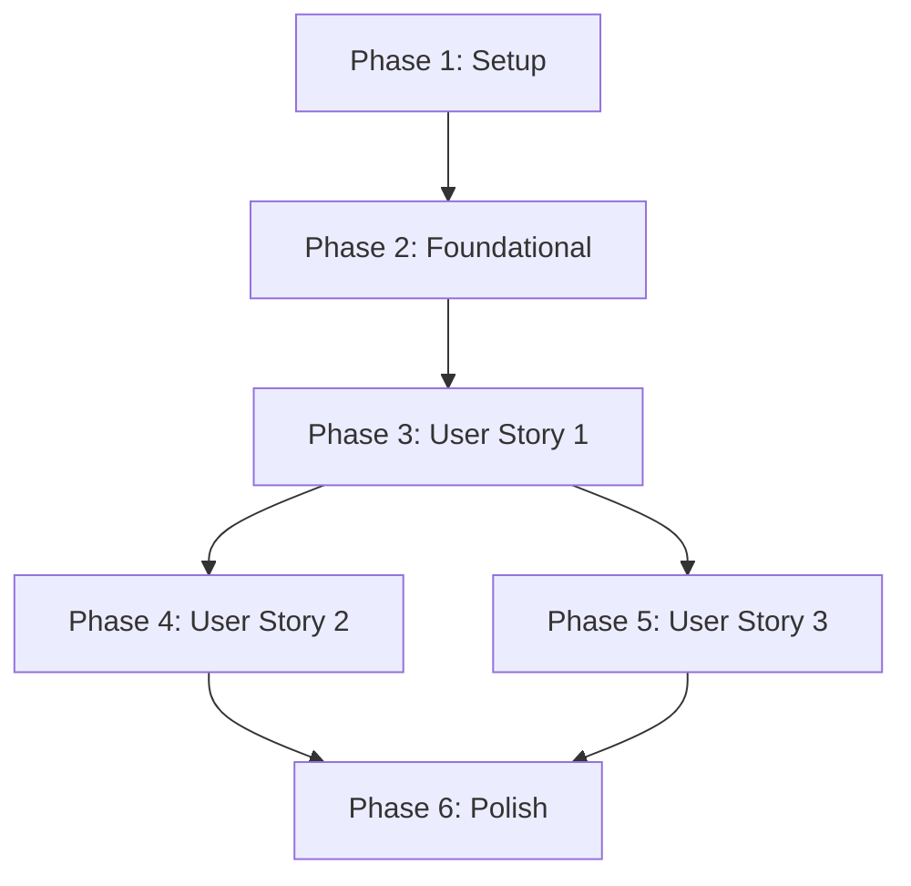

# Tasks: Verse of the Day

**Input**: Design documents from `/specs/015-verse-of-the-day/`
**Prerequisites**: plan.md, spec.md, research.md, data-model.md, contracts/

**Organization**: Tasks are grouped by user story to enable independent implementation and testing of each story.

## Format: `[ID] [P?] [Story] Description`

- **[P]**: Can run in parallel (different files, no dependencies)
- **[Story]**: Which user story this task belongs to (e.g., US1, US2, US3)
- Include exact file paths in descriptions

## Phase 1: Setup (Shared Infrastructure)

**Purpose**: Project initialization and basic structure

- [x] T001 Create feature directory structure in `lib/features/verse_of_the_day`
- [x] T002 [P] Add `timezone` dependency to `pubspec.yaml` and initialize in `lib/main.dart`

---

## Phase 2: Foundational (Blocking Prerequisites)

**Purpose**: Core infrastructure that MUST be complete before ANY user story can be implemented

- [x] T003 Implement `getRandomVerse` in `packages/bible_handler/lib/src/bible_search_provider.dart`
- [x] T004 [P] Create `VerseOfTheDaySettings` model with JSON serialization in `lib/features/verse_of_the_day/data/models/verse_of_the_day_settings.dart`
- [x] T005 [P] Implement `scheduleDailyNotification` and `cancelNotification` in `lib/core/notifications/services/local_notification_service.dart`
- [x] T006 Implement `VerseOfTheDayRepository` using `shared_preferences` in `lib/features/verse_of_the_day/data/repositories/verse_of_the_day_repository.dart`

**Checkpoint**: Foundation ready - user story implementation can now begin

---

## Phase 3: User Story 1 - Daily Verse Notification (Priority: P1) 🎯 MVP

**Goal**: Deliver a daily local notification with a random Bible verse at a scheduled time.

**Independent Test**: Schedule a notification for 1 minute in the future and verify it appears with a verse.

### Implementation for User Story 1

- [x] T007 [US1] Create `VerseOfTheDayService` to handle verse selection and scheduling logic in `lib/features/verse_of_the_day/domain/services/verse_of_the_day_service.dart`
- [ ] T008 [US1] Write unit tests for `VerseOfTheDayService` scheduling logic in `test/features/verse_of_the_day/verse_of_the_day_service_test.dart`
- [x] T009 [US1] Initialize and trigger `VerseOfTheDayService` scheduling in `lib/main.dart` on app startup

**Checkpoint**: User Story 1 functional - daily notifications are being scheduled and delivered.

---

## Phase 4: User Story 2 - Navigation to Reading Screen (Priority: P1)

**Goal**: Navigate the user to the specific verse in the reading screen when they tap the notification.

**Independent Test**: Tap a "Verse of the Day" notification and verify the app opens to the correct chapter and highlights the verse.

### Implementation for User Story 2

- [x] T010 [US2] Update `NotificationHandler` to parse `verse_of_the_day` payload in `lib/core/notifications/notification_handler.dart`
- [x] T011 [US2] Implement deep link navigation to `ReadingPage` with verse highlighting in `lib/shared/widgets/main_scaffold.dart`

**Checkpoint**: User Story 2 functional - notifications now lead to the correct content.

---

## Phase 5: User Story 3 - Service Configuration (Priority: P2)

**Goal**: Allow users to customize time, Bible version, and book categories for the notifications.

**Independent Test**: Change settings in the Profile screen and verify the next notification reflects the changes.

### Implementation for User Story 3

- [x] T012 [US3] Implement `VerseOfTheDayBloc` for settings state management in `lib/features/verse_of_the_day/presentation/bloc/verse_of_the_day_bloc.dart`
- [x] T013 [US3] Create `VerseOfTheDaySettingsPage` with time picker and category selection in `lib/features/verse_of_the_day/presentation/pages/verse_of_the_day_settings_page.dart`
- [x] T014 [US3] Add navigation to `VerseOfTheDaySettingsPage` in `lib/features/profile/presentation/views/profile_view.dart`

**Checkpoint**: User Story 3 functional - users have full control over the feature.

---

## Phase 6: Polish & Cross-cutting Concerns

- [x] T015 [P] Add "Test Notification" button to settings page for immediate verification
- [ ] T016 [P] Add localized strings for the feature in `lib/l10n/app_pt.arb` and `lib/l10n/app_en.arb`

## Dependency Graph

## Parallel Execution Examples

### Per User Story
- **US3**: T012 (Bloc) and T013 (UI) can be developed in parallel once the Repository (T006) is ready.

### Cross-Story
- T002 (Timezone setup) and T003 (SQL logic) can be done in parallel.
- T004 (Model) and T005 (Notification service) can be done in parallel.

## Implementation Strategy
- **MVP First**: Focus on Phase 1-3 to get the core notification working with default settings.
- **Incremental Delivery**: Add navigation (Phase 4) and then the full settings UI (Phase 5).
