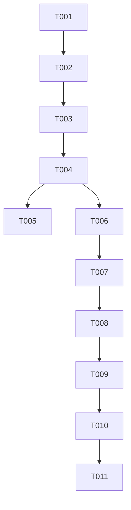

# Tasks: Book Modal Navigation & Accordion Behavior

**Input**: Design documents from `/specs/022-book-modal-behavior/`
**Prerequisites**: plan.md (required), spec.md (required for user stories)

**Organization**: Tasks are grouped by user story to enable independent implementation and testing of each story.

## Format: `[ID] [P?] [Story] Description`

- **[P]**: Can run in parallel (different files, no dependencies)
- **[Story]**: Which user story this task belongs to (e.g., [US1], [US2], [US3])
- Include exact file paths in descriptions

## Phase 1: Setup (Shared Infrastructure)

**Purpose**: Project initialization and basic structure

- [ ] T001 Initialize feature documentation and planning in `specs/022-book-modal-behavior/`

---

## Phase 2: Foundational (Blocking Prerequisites)

**Purpose**: Core logic updates that govern how expansion works across both user stories.

- [x] T002 Implement accordion logic in `BookSelectionCubit.setBookExpanded` within `lib/features/biblia/bloc/book_selection_cubit.dart`
- [x] T003 [P] Implement accordion logic in `BookSelectionCubit.toggleBookExpansion` within `lib/features/biblia/bloc/book_selection_cubit.dart`
- [x] T004 [P] Implement accordion logic in `BookSelectionCubit.updateContext` within `lib/features/biblia/bloc/book_selection_cubit.dart`

**Checkpoint**: Foundation ready - only one book can be expanded at a time in the state.

---

## Phase 3: User Story 1 - Accordion Book Expansion (Priority: P1)

**Goal**: Ensure the UI correctly reflects the single-item expansion state.

**Independent Test**: Open modal, expand Genesis, then expand Exodus. Exodus should open and Genesis should close.

### Implementation for User Story 1

- [x] T005 [US1] Verify `BibleBookListItem` reactive rebuilds in `lib/features/biblia/widgets/bible_book_list_item.dart` correctly handle state changes from T002-T004

---

## Phase 4: User Story 2 - Auto-Scroll to Current Book (Priority: P1)

**Goal**: Automatically scroll to the current book when the modal is opened.

**Independent Test**: Load the app at "Salmos", open the modal. "Salmos" should be visible and expanded.

### Implementation for User Story 2

- [x] T006 [US2] Update `BookSelectionCubit.setBookExpanded` to handle auto-expansion of current book if needed
- [x] T007 [US2] Expand the currently active book when the modal is opening in `lib/features/biblia/modals/switch_book_modal.dart`
- [x] T008 [US2] Implement auto-scroll logic using `ScrollController.animateTo` with calculated offset in `lib/features/biblia/modals/modalpages/list_bible_books_modalpage.dart`
- [x] T009 [US2] Refine estimated height calculation for books (accounting for Testament headers) in `lib/features/biblia/modals/modalpages/list_bible_books_modalpage.dart`

---

## Phase 5: Polish & Cross-Cutting Concerns

- [x] T010 [P] Ensure smooth animation for both accordion toggle and auto-scroll
- [x] T011 [P] Verify that manual scrolling still updates the persistent `scrollOffset` correctly after auto-scroll completes

## Dependency Graph

## Parallel Execution Examples

- **Foundational Logic**: T003 and T004 can be implemented simultaneously after T002.
- **Polish**: T010 and T011 can be verified independently.

## Implementation Strategy

1. **MVP**: Focus on T002-T005 (Accordion behavior) first. This delivers immediate organizational value.
2. **Auto-scroll**: Implement T006-T009. This requires more precise UI calculations but significantly enhances the navigation experience.
