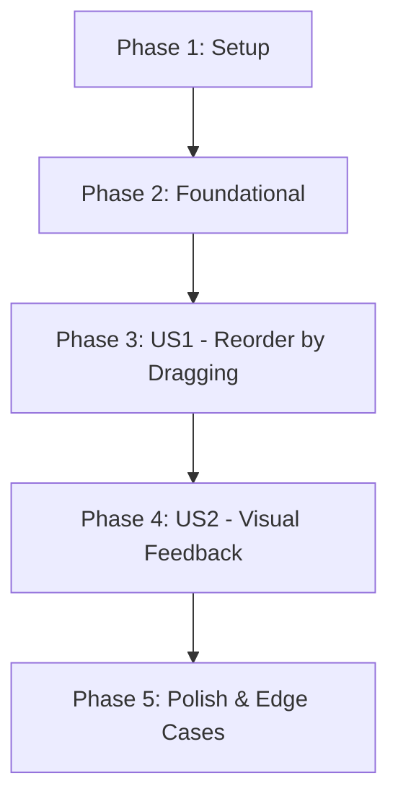

# Tasks: Reorder Search Inputs

**Input**: Design documents from `specs/025-reorder-search-fields/`
**Prerequisites**: [plan.md](plan.md), [spec.md](spec.md), [research.md](research.md), [data-model.md](data-model.md)

## Implementation Strategy

We will follow an incremental approach:
1.  **Foundational**: Update the BLoC to handle the reorder logic safely (especially the index 0 operator rules).
2.  **User Story 1 (P1)**: Implement the core drag-and-drop UI using `ReorderableListView`.
3.  **User Story 2 (P2)**: Refine the visual feedback during dragging.
4.  **Polish**: Handle edge cases like hiding handles for single inputs and ensuring search refreshes.

## Dependency Graph

## Phase 1: Setup

- [ ] T001 Define `ReordenarConsultas` event in `lib/features/search/presentation/bloc/search_event.dart`

## Phase 2: Foundational (BLoC Logic)

- [ ] T002 Implement `_onReorderQueryParts` event handler in `lib/features/search/presentation/bloc/search_bloc.dart`
- [ ] T003 Ensure `JoinOperator.none` is correctly assigned to index 0 after reorder in `lib/features/search/presentation/bloc/search_bloc.dart`
- [ ] T004 Verify that reordering triggers `_realizarBusca()` in `lib/features/search/presentation/bloc/search_bloc.dart`

## Phase 3: User Story 1 - Reorder search queries by dragging (Priority: P1)

**Story Goal**: Users can reorder search fields manually to change search priority.
**Independent Test**: Add 2 terms, swap them, and confirm the new order persists and triggers search.

- [ ] T005 [P] [US1] Add `dragHandle` leading widget capability to `SearchInputBar` in `lib/features/search/presentation/widgets/search_input_bar.dart`
- [ ] T006 [US1] Replace the Column with `ReorderableListView` (shrinkWrap: true, no physics) in `lib/features/search/presentation/widgets/multiple_search_header.dart`
- [ ] T007 [US1] Wrap `SearchInputBar` with `ReorderableDragStartListener` in `lib/features/search/presentation/widgets/multiple_search_header.dart`
- [ ] T008 [US1] Connect `onReorder` callback to `SearchBloc.add(ReordenarConsultas)` in `lib/features/search/presentation/widgets/multiple_search_header.dart`

## Phase 4: User Story 2 - Real-time visual feedback (Priority: P2)

**Story Goal**: Smooth animations and clear drop indicators during drag.
**Independent Test**: Drag an item and verify that other items animate out of the way.

- [ ] T009 [P] [US2] Implement a `proxyDecorator` to enhance the appearance of the dragged item in `lib/features/search/presentation/widgets/multiple_search_header.dart`

## Phase 5: Polish & Edge Cases

- [ ] T010 Hide the drag handle if `consultas.length == 1` in `lib/features/search/presentation/widgets/search_input_bar.dart`
- [ ] T011 Ensure `hintText` ("Buscar por..." vs "E também por...") updates based on new index positions in `lib/features/search/presentation/widgets/multiple_search_header.dart`
- [ ] T012 Verify that `TextField` focus is maintained or gracefully handled after a reorder in `lib/features/search/presentation/widgets/search_input_bar.dart`

## Parallel Execution Examples

- **T005** (UI Component) can be developed in parallel with **T002/T003** (BLoC logic).
- **T009** (Visual Refinement) can be developed in parallel with **T001** if placeholder calls are used.
